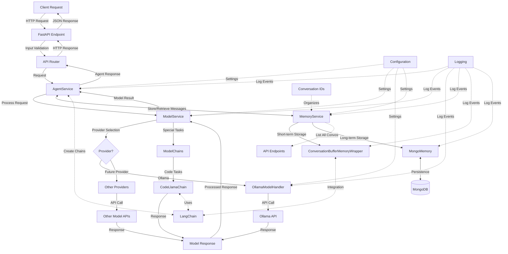

# AI Agent Template

A flexible, modular API for interacting with various AI models through a unified interface.

## Architecture Flow

The AI Agent Template follows a clean, layered architecture with clear separation of concerns:

## Key Components

- **API Layer**: Handles HTTP requests and routes them to appropriate services
- **Agent Service**: Orchestrates the processing of requests
- **Model Service**: Manages access to different model providers
- **Model Handlers**: Provider-specific implementations for model interaction
- **Memory Service**: Coordinates short-term and long-term memory storage
- **MongoDB Memory**: Provides persistent storage for conversation history
- **Buffer Memory**: Wraps LangChain's memory for active sessions

## Features

- Unified API for multiple AI model providers
- Extensible architecture for adding new model providers
- Consistent interface regardless of underlying model
- Configurable settings for model parameters
- Comprehensive logging
- Persistent conversation history with MongoDB
- Multi-conversation support with unique IDs
- LangChain integration for advanced chains and memory

### Intelligent Model Selection

The Agent Service includes content-based model routing:

- Code-related tasks → CodeLlama
- Creative content → Mistral
- Mathematical queries → Llama2
- Translation tasks → DeepSeek-R1
- General queries → Default model (configurable)

### Supported Model Providers

- **Ollama**: Local model deployment with support for:
  - Llama2
  - CodeLlama
  - Mistral
  - DeepSeek-R1
  
- **Future Providers**:
  - Architecture prepared for LM Studio
  - Support for additional cloud-based models

  ### Memory System

The Agent Template features a dual-layer memory architecture:

- **Short-Term Memory**: Uses LangChain's ConversationBufferMemory for active sessions
  - Fast in-memory storage for current conversations
  - Direct integration with LangChain chains and models
  - Automatically manages conversation context

- **Long-Term Memory**: MongoDB-based persistent storage
  - Stores full conversation history across application restarts
  - Supports multiple conversation IDs for organization
  - Efficient retrieval of recent or complete conversation history

- **Seamless Fallback**: If MongoDB is unavailable, the system continues working with in-memory storage only

### Conversation Management

The system supports multiple simultaneous conversations:

- **Conversation IDs**: Each conversation has a unique identifier
- **Default Conversation**: Conversations without an explicit ID use the "default" conversation
- **History Retrieval**: API support for loading full or recent message history
- **Conversation Listing**: Ability to enumerate all available conversations
- **Conversation Clearing**: Support for clearing conversation history when needed

## Technical Requirements

- **Python 3.9+**
- **MongoDB**: For persistent conversation storage
- **Ollama**: For local model deployment
- **FastAPI**: For API endpoints and request handling
- **LangChain**: For conversation chains and memory integration