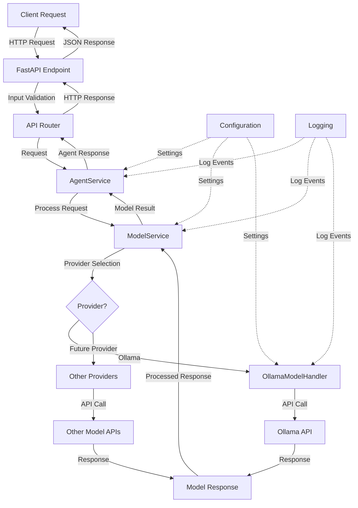

# AI Agent Template

A flexible, modular API for interacting with various AI models through a unified interface.

## Architecture Flow

The AI Agent Template follows a clean, layered architecture with clear separation of concerns:

## Key Components

- **API Layer**: Handles HTTP requests and routes them to appropriate services
- **Agent Service**: Orchestrates the processing of requests
- **Model Service**: Manages access to different model providers
- **Model Handlers**: Provider-specific implementations for model interaction

## Features

- Unified API for multiple AI model providers
- Extensible architecture for adding new model providers
- Consistent interface regardless of underlying model
- Configurable settings for model parameters
- Comprehensive logging

### Intelligent Model Selection

The Agent Service includes content-based model routing:

- Code-related tasks → CodeLlama
- Creative content → Mistral
- Mathematical queries → Llama2
- Translation tasks → DeepSeek-R1
- General queries → Default model (configurable)

### Supported Model Providers

- **Ollama**: Local model deployment with support for:
  - Llama2
  - CodeLlama
  - Mistral
  - DeepSeek-R1
  
- **Future Providers**:
  - Architecture prepared for LM Studio
  - Support for additional cloud-based models